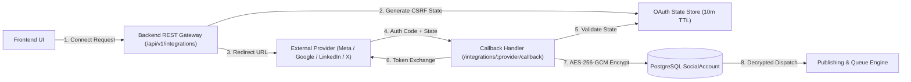

# External Platform Integrations & OAuth Infrastructure

## 1. Overview & Architecture

The Antigravity Agency Platform connects multi-tenant marketing workspaces to external social and ad networks (Meta, Google, LinkedIn, X/Twitter, YouTube).



---

## 2. Multi-Platform OAuth Setup & Required Environment Variables

### A. Meta (Facebook Pages & Instagram Professional)
- **Environment Variables**:
  ```env
  META_APP_ID=your_meta_app_id
  META_APP_SECRET=your_meta_app_secret
  META_REDIRECT_URI=https://antigravity-agency-platform.onrender.com/api/v1/integrations/meta/callback
  ```
- **OAuth Scopes**:
  - `pages_show_list`, `pages_read_engagement`, `pages_manage_posts`, `instagram_basic`, `instagram_content_publish`, `business_management`
- **Supported Capabilities**:
  - Facebook Page publishing, Instagram Professional Carousel/Reels publishing, Lead ads webhook ingestion.

### B. Google (YouTube, Google Business Profile & Google Ads)
- **Environment Variables**:
  ```env
  GOOGLE_CLIENT_ID=your_google_client_id
  GOOGLE_CLIENT_SECRET=your_google_client_secret
  GOOGLE_REDIRECT_URI=https://antigravity-agency-platform.onrender.com/api/v1/integrations/google/callback
  ```
- **OAuth Scopes**:
  - `https://www.googleapis.com/auth/youtube.upload`, `https://www.googleapis.com/auth/business.manage`
- **Supported Capabilities**:
  - YouTube Video publishing, Google Business post publishing, profile discovery.

### C. LinkedIn (Organization & Personal Profile)
- **Environment Variables**:
  ```env
  LINKEDIN_CLIENT_ID=your_linkedin_client_id
  LINKEDIN_CLIENT_SECRET=your_linkedin_client_secret
  LINKEDIN_REDIRECT_URI=https://antigravity-agency-platform.onrender.com/api/v1/integrations/linkedin/callback
  ```
- **OAuth Scopes**:
  - `openid`, `profile`, `email`, `w_member_social`
- **Supported Capabilities**:
  - LinkedIn post publishing, company page attribution, author verification.

### D. X / Twitter (OAuth 2.0 PKCE)
- **Environment Variables**:
  ```env
  TWITTER_CLIENT_ID=your_twitter_client_id
  TWITTER_CLIENT_SECRET=your_twitter_client_secret
  TWITTER_REDIRECT_URI=https://antigravity-agency-platform.onrender.com/api/v1/integrations/twitter/callback
  ```
- **OAuth Scopes**:
  - `tweet.read`, `tweet.write`, `users.read`, `offline.access`

### E. Server-Side Token Encryption
- **Environment Variable**:
  ```env
  OAUTH_TOKEN_ENCRYPTION_KEY=your_secure_32_byte_hex_key
  ```

---

## 3. Security & Multi-Tenant Guarantees

1. **Envelope Token Encryption (AES-256-GCM)**:
   - All OAuth access tokens and refresh tokens are encrypted server-side before persistence to PostgreSQL. Plaintext tokens are never stored in the database and never exposed in REST API payloads.
2. **CSRF State Token Validation**:
   - Single-use state tokens generated via `crypto.randomBytes(32)` bind the connection attempt to the specific authenticated `agencyId`, `clientId`, and `userId` with a 10-minute TTL.
3. **Cross-Tenant Account Isolation**:
   - Account attachments are strictly validated against `req.agencyId`. Cross-agency account linking attempts are rejected with `403 Forbidden` / `404 Not Found`.
4. **Configuration Gating & Zero Fabricated Data**:
   - When OAuth application credentials or access tokens are missing or expired, endpoints return `CONFIGURATION_REQUIRED` or `REAUTH_REQUIRED`. The platform never fabricates fake external tokens, dummy post IDs, or false publishing confirmations.
