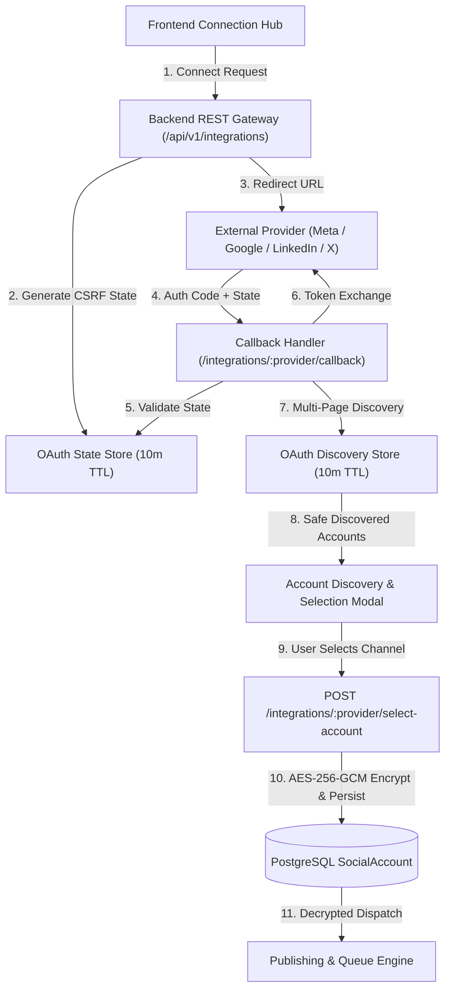
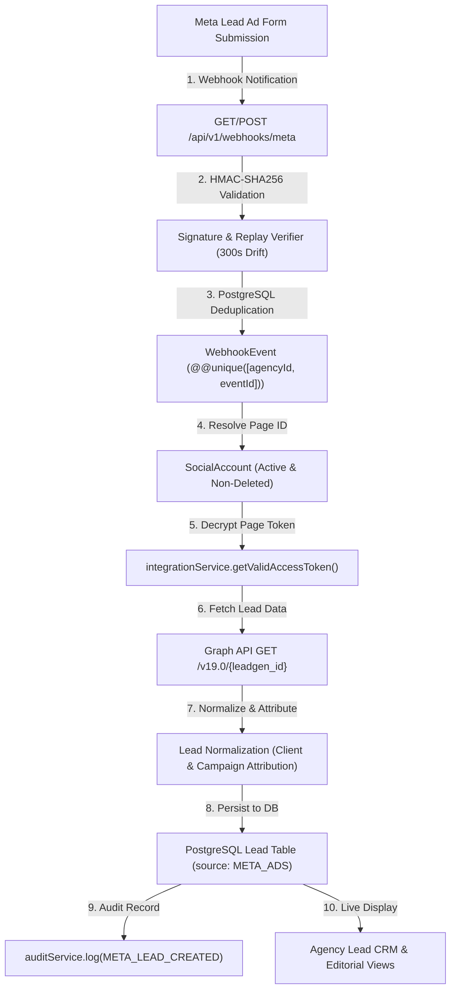

# External Platform Integrations & OAuth Infrastructure

## 1. Overview & Architecture

The Antigravity Agency Platform connects multi-tenant marketing workspaces to external social and ad networks (Meta, Google, LinkedIn, X/Twitter, YouTube).



---

## 2. Multi-Platform OAuth Setup & Required Environment Variables

### A. Meta (Facebook Pages & Instagram Professional)
- **Environment Variables**:
  ```env
  META_APP_ID=your_meta_app_id
  META_APP_SECRET=your_meta_app_secret
  META_REDIRECT_URI=https://antigravity-agency-platform.onrender.com/api/v1/integrations/meta/callback
  ```
- **OAuth Scopes**:
  - `pages_show_list`, `pages_read_engagement`, `pages_manage_posts`, `instagram_basic`, `instagram_content_publish`, `business_management`
- **Supported Capabilities**:
  - Facebook Page publishing, Instagram Professional Carousel/Reels publishing, Lead ads webhook ingestion, multi-page discovery.

### B. Google (YouTube, Google Business Profile & Google Ads)
- **Environment Variables**:
  ```env
  GOOGLE_CLIENT_ID=your_google_client_id
  GOOGLE_CLIENT_SECRET=your_google_client_secret
  GOOGLE_REDIRECT_URI=https://antigravity-agency-platform.onrender.com/api/v1/integrations/google/callback
  ```
- **OAuth Scopes**:
  - `https://www.googleapis.com/auth/youtube.upload`, `https://www.googleapis.com/auth/youtube.readonly`, `https://www.googleapis.com/auth/business.manage`, `https://www.googleapis.com/auth/userinfo.profile`, `https://www.googleapis.com/auth/userinfo.email`
- **Supported Capabilities**:
  - YouTube Video publishing, Google Business post publishing, profile and channel discovery.

### C. LinkedIn (Organization & Personal Profile)
- **Environment Variables**:
  ```env
  LINKEDIN_CLIENT_ID=your_linkedin_client_id
  LINKEDIN_CLIENT_SECRET=your_linkedin_client_secret
  LINKEDIN_REDIRECT_URI=https://antigravity-agency-platform.onrender.com/api/v1/integrations/linkedin/callback
  ```
- **OAuth Scopes**:
  - `openid`, `profile`, `email`, `w_member_social`
- **Supported Capabilities**:
  - LinkedIn post publishing, company page attribution, author verification, member profile and company page discovery.

### D. X / Twitter (OAuth 2.0 PKCE)
- **Environment Variables**:
  ```env
  TWITTER_CLIENT_ID=your_twitter_client_id
  TWITTER_CLIENT_SECRET=your_twitter_client_secret
  TWITTER_REDIRECT_URI=https://antigravity-agency-platform.onrender.com/api/v1/integrations/twitter/callback
  ```
- **OAuth Scopes**:
  - `tweet.read`, `tweet.write`, `users.read`, `offline.access`
- **Supported Capabilities**:
  - Tweet publishing, thread creation, media attachment, profile discovery.

### E. Server-Side Token Encryption
- **Environment Variable**:
  ```env
  OAUTH_TOKEN_ENCRYPTION_KEY=your_secure_32_byte_hex_key
  ```

---

## 3. Security & Multi-Tenant Guarantees

1. **Envelope Token Encryption (AES-256-GCM)**:
   - All OAuth access tokens and refresh tokens are encrypted server-side before persistence to PostgreSQL. Plaintext tokens are never stored in the database and never exposed in REST API payloads.
2. **CSRF State Token Validation**:
   - Single-use state tokens generated via `crypto.randomBytes(32)` bind the connection attempt to the specific authenticated `agencyId`, `clientId`, and `userId` with a 10-minute TTL.
3. **Discovery Session Store (Single-Use Token & Zero Frontend Secrets)**:
   - Discovered accounts and unpersisted credentials are held in a short-lived server-side session cache. Frontend receives only safe presentation metadata (name, handle, avatar, masked ID).
4. **Cross-Tenant Account Isolation**:
   - Account attachments and selection tokens are strictly validated against `req.agencyId`. Cross-agency account linking attempts are rejected with `403 Forbidden` / `404 Not Found`.
5. **Configuration Gating & Zero Fabricated Data**:
   - When OAuth application credentials or access tokens are missing or expired, endpoints return `CONFIGURATION_REQUIRED` or `REAUTH_REQUIRED`. The platform never fabricates fake external tokens, dummy post IDs, or false publishing confirmations.

---

## 4. User Connection & Lifecycle Workflows

### A. Initial Connection & Discovery Workflow
1. Navigate to **Social Accounts** from the agency dashboard navigation.
2. Select target client workspace filter (or keep "All Clients").
3. In the **Platform Connection Hub**, click **Connect Channel** on your desired provider card.
4. If provider credentials are configured, the browser redirects to the external provider login and authorization screen.
5. Upon authorizing, the callback handler verifies the single-use CSRF token, exchanges the authorization code for tokens, and queries the provider API to discover all available pages, profiles, and channels.
6. If multiple assets exist, the **Account Discovery Modal** presents the authorized assets for operator selection.
7. Confirming selection sends `POST /api/v1/integrations/:provider/select-account` to encrypt credentials with AES-256-GCM and register the account in PostgreSQL with `status: ACTIVE`.
8. If provider credentials are not configured, the system displays a clear diagnostic notice: `CONFIGURATION_REQUIRED`.

### B. Synchronization Workflow ("Sync Now")
1. Click **Inspect** on any connected account card.
2. Click **Sync Now** to trigger `POST /api/v1/integrations/:id/sync`.
3. The server decrypts the token, checks freshness, fetches the latest platform metadata, and updates PostgreSQL.

### C. Reconnect Procedure ("Reconnect")
1. When token expires or status changes to `NEEDS_REAUTH`, click **Reconnect Channel**.
2. The server initiates a new OAuth handshake (`POST /api/v1/integrations/:id/reconnect`).
3. Re-authorization updates the encrypted credentials and resets status to `ACTIVE`.

### D. Disconnect Procedure ("Disconnect")
1. In the account detail modal, click **Disconnect Account**.
2. Confirm the safety warning dialog: *"Disconnecting this account will stop publishing and synchronization for this channel."*
3. The server revokes the external token where supported, purges all encrypted tokens from PostgreSQL metadata, marks status as `DISCONNECTED`, and records an audit trail.

---

## 5. Troubleshooting & Health Indicators

- **`ACTIVE` (Healthy)**: Token valid, channel operational for publishing and analytics.
- **`NEEDS_REAUTH` (Action Required)**: Token expired or permission revoked by channel administrator. Click **Reconnect** to re-authorize.
- **`DISCONNECTED` (Archived)**: Account unlinked, encrypted credentials purged from database.
- **`CONFIGURATION_REQUIRED` (DevOps Setup)**: Missing provider App ID / Secret in hosting environment variables.
- **`NO_ACCOUNTS_FOUND` (Empty Discovery)**: User completed OAuth flow but does not manage any pages, channels, or locations under that account.

---

## 6. Real Meta Leadgen Webhooks & CRM Integration

### A. Pipeline Architecture


### B. Meta Webhook Configuration
- **Callback URL**: `https://antigravity-agency-platform.onrender.com/api/v1/webhooks/meta`
- **Verify Token**: Configured via `META_WEBHOOK_VERIFY_TOKEN` (or `META_WA_WEBHOOK_SECRET`)
- **App Secret**: `META_APP_SECRET` (used for `X-Hub-Signature-256` HMAC validation)
- **Subscribed Fields**: `leadgen`, `feed`, `comments`, `messages`

### C. Security & Data Integrity Guarantees
1. **Multi-Tenant Isolation**: Page IDs are resolved strictly against the `SocialAccount` records belonging to the matching tenant `agencyId`. Cross-agency event delivery is immediately rejected with `403 Forbidden` / `404 Not Found`.
2. **Replay Drift Protection**: Webhooks older than 300 seconds (5 minutes) are discarded to prevent replay attacks.
3. **Idempotent Ingestion**: Every delivery persists a unique `WebhookEvent` record (`@@unique([agencyId, eventId])`). Duplicate deliveries return `{ duplicate: true }` without duplicating CRM leads.
4. **Zero Secret Exposure**: Tokens and secrets are never emitted in logs or response payloads. Audit logs record entity IDs and timestamps only.
5. **No Fabricated Leads**: If external Meta credentials or Page tokens are unconfigured or expired, the pipeline returns `CONFIGURATION_REQUIRED` or `REAUTH_REQUIRED` rather than creating synthetic data.

