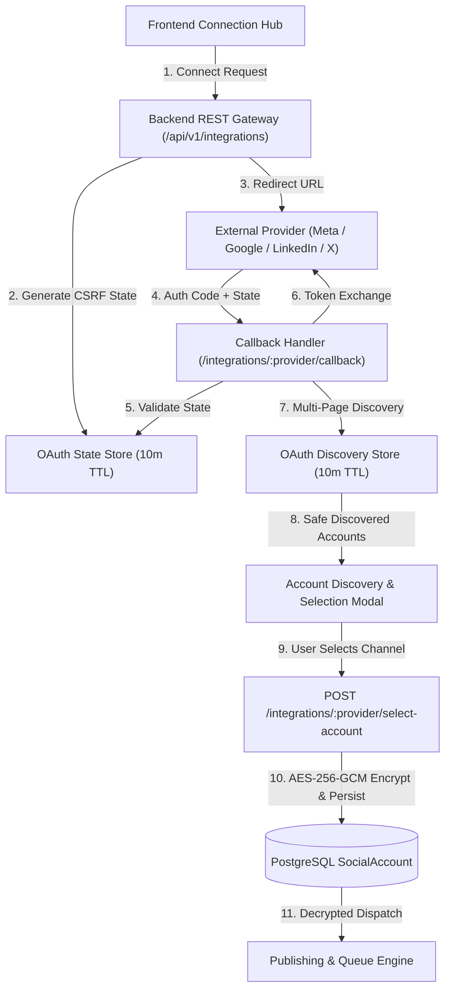
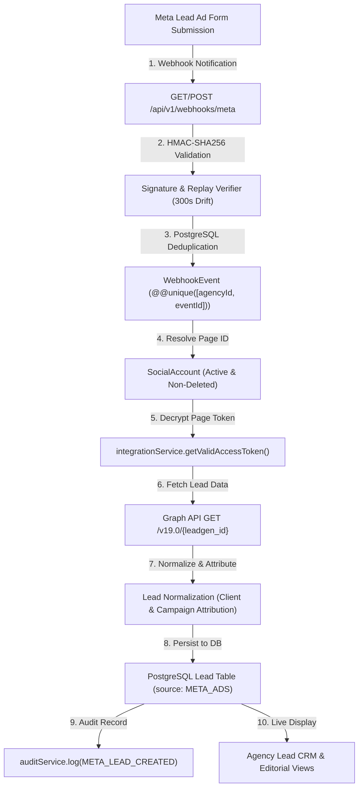
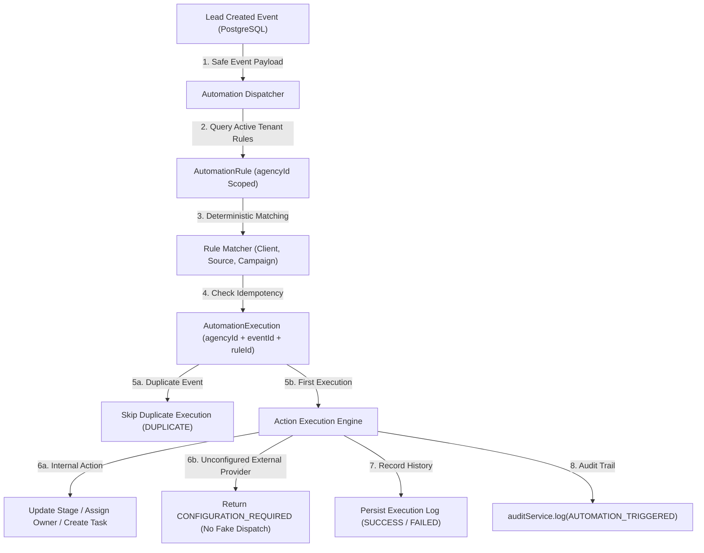

# External Platform Integrations & OAuth Infrastructure

## 1. Overview & Architecture

The Antigravity Agency Platform connects multi-tenant marketing workspaces to external social and ad networks (Meta, Google, LinkedIn, X/Twitter, YouTube).



---

## 2. Multi-Platform OAuth Setup & Required Environment Variables

### A. Meta (Facebook Pages & Instagram Professional)
- **Environment Variables**:
  ```env
  META_APP_ID=your_meta_app_id
  META_APP_SECRET=your_meta_app_secret
  META_REDIRECT_URI=https://antigravity-agency-platform.onrender.com/api/v1/integrations/meta/callback
  ```
- **OAuth Scopes**:
  - `pages_show_list`, `pages_read_engagement`, `pages_manage_posts`, `instagram_basic`, `instagram_content_publish`, `business_management`
- **Supported Capabilities**:
  - Facebook Page publishing, Instagram Professional Carousel/Reels publishing, Lead ads webhook ingestion, multi-page discovery.

### B. Google (YouTube, Google Business Profile & Google Ads)
- **Environment Variables**:
  ```env
  GOOGLE_CLIENT_ID=your_google_client_id
  GOOGLE_CLIENT_SECRET=your_google_client_secret
  GOOGLE_REDIRECT_URI=https://antigravity-agency-platform.onrender.com/api/v1/integrations/google/callback
  ```
- **OAuth Scopes**:
  - `https://www.googleapis.com/auth/youtube.upload`, `https://www.googleapis.com/auth/youtube.readonly`, `https://www.googleapis.com/auth/business.manage`, `https://www.googleapis.com/auth/userinfo.profile`, `https://www.googleapis.com/auth/userinfo.email`
- **Supported Capabilities**:
  - YouTube Video publishing, Google Business post publishing, profile and channel discovery.

### C. LinkedIn (Organization & Personal Profile)
- **Environment Variables**:
  ```env
  LINKEDIN_CLIENT_ID=your_linkedin_client_id
  LINKEDIN_CLIENT_SECRET=your_linkedin_client_secret
  LINKEDIN_REDIRECT_URI=https://antigravity-agency-platform.onrender.com/api/v1/integrations/linkedin/callback
  ```
- **OAuth Scopes**:
  - `openid`, `profile`, `email`, `w_member_social`
- **Supported Capabilities**:
  - LinkedIn post publishing, company page attribution, author verification, member profile and company page discovery.

### D. X / Twitter (OAuth 2.0 PKCE)
- **Environment Variables**:
  ```env
  TWITTER_CLIENT_ID=your_twitter_client_id
  TWITTER_CLIENT_SECRET=your_twitter_client_secret
  TWITTER_REDIRECT_URI=https://antigravity-agency-platform.onrender.com/api/v1/integrations/twitter/callback
  ```
- **OAuth Scopes**:
  - `tweet.read`, `tweet.write`, `users.read`, `offline.access`
- **Supported Capabilities**:
  - Tweet publishing, thread creation, media attachment, profile discovery.

### E. Server-Side Token Encryption
- **Environment Variable**:
  ```env
  OAUTH_TOKEN_ENCRYPTION_KEY=your_secure_32_byte_hex_key
  ```

---

## 3. Security & Multi-Tenant Guarantees

1. **Envelope Token Encryption (AES-256-GCM)**:
   - All OAuth access tokens and refresh tokens are encrypted server-side before persistence to PostgreSQL. Plaintext tokens are never stored in the database and never exposed in REST API payloads.
2. **CSRF State Token Validation**:
   - Single-use state tokens generated via `crypto.randomBytes(32)` bind the connection attempt to the specific authenticated `agencyId`, `clientId`, and `userId` with a 10-minute TTL.
3. **Discovery Session Store (Single-Use Token & Zero Frontend Secrets)**:
   - Discovered accounts and unpersisted credentials are held in a short-lived server-side session cache. Frontend receives only safe presentation metadata (name, handle, avatar, masked ID).
4. **Cross-Tenant Account Isolation**:
   - Account attachments and selection tokens are strictly validated against `req.agencyId`. Cross-agency account linking attempts are rejected with `403 Forbidden` / `404 Not Found`.
5. **Configuration Gating & Zero Fabricated Data**:
   - When OAuth application credentials or access tokens are missing or expired, endpoints return `CONFIGURATION_REQUIRED` or `REAUTH_REQUIRED`. The platform never fabricates fake external tokens, dummy post IDs, or false publishing confirmations.

---

## 4. User Connection & Lifecycle Workflows

### A. Initial Connection & Discovery Workflow
1. Navigate to **Social Accounts** from the agency dashboard navigation.
2. Select target client workspace filter (or keep "All Clients").
3. In the **Platform Connection Hub**, click **Connect Channel** on your desired provider card.
4. If provider credentials are configured, the browser redirects to the external provider login and authorization screen.
5. Upon authorizing, the callback handler verifies the single-use CSRF token, exchanges the authorization code for tokens, and queries the provider API to discover all available pages, profiles, and channels.
6. If multiple assets exist, the **Account Discovery Modal** presents the authorized assets for operator selection.
7. Confirming selection sends `POST /api/v1/integrations/:provider/select-account` to encrypt credentials with AES-256-GCM and register the account in PostgreSQL with `status: ACTIVE`.
8. If provider credentials are not configured, the system displays a clear diagnostic notice: `CONFIGURATION_REQUIRED`.

### B. Synchronization Workflow ("Sync Now")
1. Click **Inspect** on any connected account card.
2. Click **Sync Now** to trigger `POST /api/v1/integrations/:id/sync`.
3. The server decrypts the token, checks freshness, fetches the latest platform metadata, and updates PostgreSQL.

### C. Reconnect Procedure ("Reconnect")
1. When token expires or status changes to `NEEDS_REAUTH`, click **Reconnect Channel**.
2. The server initiates a new OAuth handshake (`POST /api/v1/integrations/:id/reconnect`).
3. Re-authorization updates the encrypted credentials and resets status to `ACTIVE`.

### D. Disconnect Procedure ("Disconnect")
1. In the account detail modal, click **Disconnect Account**.
2. Confirm the safety warning dialog: *"Disconnecting this account will stop publishing and synchronization for this channel."*
3. The server revokes the external token where supported, purges all encrypted tokens from PostgreSQL metadata, marks status as `DISCONNECTED`, and records an audit trail.

---

## 5. Troubleshooting & Health Indicators

- **`ACTIVE` (Healthy)**: Token valid, channel operational for publishing and analytics.
- **`NEEDS_REAUTH` (Action Required)**: Token expired or permission revoked by channel administrator. Click **Reconnect** to re-authorize.
- **`DISCONNECTED` (Archived)**: Account unlinked, encrypted credentials purged from database.
- **`CONFIGURATION_REQUIRED` (DevOps Setup)**: Missing provider App ID / Secret in hosting environment variables.
- **`NO_ACCOUNTS_FOUND` (Empty Discovery)**: User completed OAuth flow but does not manage any pages, channels, or locations under that account.

---

## 6. Real Meta Leadgen Webhooks & CRM Integration

### A. Pipeline Architecture


### B. Meta Webhook Configuration
- **Callback URL**: `https://antigravity-agency-platform.onrender.com/api/v1/webhooks/meta`
- **Verify Token**: Configured via `META_WEBHOOK_VERIFY_TOKEN` (or `META_WA_WEBHOOK_SECRET`)
- **App Secret**: `META_APP_SECRET` (used for `X-Hub-Signature-256` HMAC validation)
- **Subscribed Fields**: `leadgen`, `feed`, `comments`, `messages`

### C. Security & Data Integrity Guarantees
1. **Multi-Tenant Isolation**: Page IDs are resolved strictly against the `SocialAccount` records belonging to the matching tenant `agencyId`. Cross-agency event delivery is immediately rejected with `403 Forbidden` / `404 Not Found`.
2. **Replay Drift Protection**: Webhooks older than 300 seconds (5 minutes) are discarded to prevent replay attacks.
3. **Idempotent Ingestion**: Every delivery persists a unique `WebhookEvent` record (`@@unique([agencyId, eventId])`). Duplicate deliveries return `{ duplicate: true }` without duplicating CRM leads.
4. **Zero Secret Exposure**: Tokens and secrets are never emitted in logs or response payloads. Audit logs record entity IDs and timestamps only.
5. **No Fabricated Leads**: If external Meta credentials or Page tokens are unconfigured or expired, the pipeline returns `CONFIGURATION_REQUIRED` or `REAUTH_REQUIRED` rather than creating synthetic data.

---

## 7. Real-Time Lead Automation Workflows & Execution Engine

### A. Workflow Architecture


### B. Supported Triggers & Actions
- **Triggers**:
  - `LEAD_CREATED`: Dispatched immediately when a new lead is persisted from a verified Meta Lead Ads webhook, CRM API, or direct intake.
- **Actions**:
  - `CRM_UPDATE_STAGE`: Advances lead pipeline stage (`NEW` -> `CONTACTED` -> `QUALIFIED` -> `PROPOSAL_SENT` -> `WON` / `LOST`).
  - `CRM_ASSIGN_OWNER`: Designates lead owner to operational agency personnel.
  - `CRM_CREATE_TASK`: Schedules a follow-up action for sales specialists with unique DB task ID.
  - `WHATSAPP_SEND`: Dispatches real Meta WhatsApp Cloud API messages (or returns `CONFIGURATION_REQUIRED` if unconfigured).
  - `EMAIL_SEND`: Sends transactional notifications via Resend / SendGrid / SMTP (or returns `CONFIGURATION_REQUIRED`).
  - `SMS_SEND`: Sends SMS messages via Twilio (or returns `CONFIGURATION_REQUIRED`).
  - `WEBHOOK_FORWARD`: SSRF-protected outbound HTTPS webhook forwarding with 5s timeout.
  - `LOG_AUDIT_EVENT`: Creates a cryptographically safe audit record.

### C. Idempotency & Safety Guarantees
- **Persistent Key**: `agencyId:eventId:automationId` ensures no automation is triggered more than once for the same event delivery.
- **RBAC**: Operational roles (`OWNER`, `ADMIN`, `MANAGER`, `OPERATOR`) can configure rules and trigger manual test actions; `VIEWER` and `ANALYST` have read-only access (`403 Forbidden`).
- **Zero Token Leakage**: Execution history records only task parameters, status, timestamps, and error summaries with all secrets sanitized.

---

## 8. External Action Engine, SSRF Guard & Failure Classification

### A. SSRF Protection Model
The `ssrfGuard` evaluates all outbound URLs prior to dispatch:
1. **Protocol Enforcement**: Only `https:` (and explicitly designated `http:` targets) are allowed.
2. **Loopback & Host Blacklisting**: Explicitly blocks `localhost`, `127.0.0.1`, `0.0.0.0`, `::1`, `metadata.google.internal`, `instance-data`.
3. **Private IP Blocking**: Blocks IPv4 RFC1918 ranges (`10.0.0.0/8`, `172.16.0.0/12`, `192.168.0.0/16`).
4. **Link-Local & Cloud Metadata Blocking**: Blocks `169.254.0.0/16` (e.g., `169.254.169.254`).
5. **IPv6 Boundary Protection**: Blocks `fe80:`, `fc00:`, `fd00:`, `[::1]`.

### B. Standardized Execution States
- **`SUCCESS`**: Action was verified and executed by the internal engine or confirmed by the external provider API.
- **`CONFIGURATION_REQUIRED`**: External delivery channel credentials (Meta WhatsApp, Twilio, Resend) are unset in the environment.
- **`NEEDS_REAUTH`**: External provider returned HTTP 401 or 403 due to invalid/expired tokens.
- **`RATE_LIMITED`**: Provider returned HTTP 429 Too Many Requests.
- **`FAILED`**: Malformed payload, network timeout (5s limit), or permanent 4xx/5xx rejection.
- **`DUPLICATE`**: Duplicate event ID skipped via persistent idempotency check.

### C. Manual Action Test API
- **Endpoint**: `POST /api/v1/automations/:id/test`
- **Safeguard**: Requires `{ confirmed: true }` in request body.
- **RBAC**: Only `OWNER`, `ADMIN`, `MANAGER`, `OPERATOR` roles may invoke test actions.

---

## 9. Automation Reliability, Retries & Async Recovery

### A. Deterministic Failure Classification & Retryability
The retry policy engine (`retryPolicy.js`) deterministically categorizes execution results:
- **`RATE_LIMITED` (HTTP 429)**: Eligible for bounded exponential retry.
- **`TEMPORARY_FAILURE` (HTTP 408, 5xx, Network Timeouts, Socket Resets)**: Eligible for bounded exponential retry.
- **`NEEDS_REAUTH` (HTTP 401/403)**: Non-retryable without administrative token re-authentication.
- **`FAILED` (HTTP 400, 422, Permanent 4xx)**: Non-retryable validation error.
- **`CONFIGURATION_REQUIRED`**: Gated until provider credentials are supplied in the environment.
- **`DUPLICATE`**: Skipped via persistent idempotency check.

### B. Bounded Exponential Backoff
- **Backoff Formula**: `delay = Math.min(maxDelay, baseDelay * 2^(attempt - 1)) ± jitter`
- **Defaults**: `maxAttempts: 5`, `baseDelayMs: 1000ms`, `maxDelayMs: 60000ms`.
- **Retry-After Header**: Automatically parsed and clamped to `maxDelayMs`.

### C. Manual Retry API
- **Endpoint**: `POST /api/v1/automations/executions/:executionId/retry`
- **RBAC**: Restricted to `OWNER`, `ADMIN`, `MANAGER`, `OPERATOR`.
- **Guardrails**: Rejects attempts to retry already `SUCCESS` or `DUPLICATE` records. Maximum attempt cap strictly enforced at 5 attempts.
- **Audit Trail**: Logs `AUTOMATION_MANUAL_RETRY` and `AUTOMATION_RETRY_SUCCEEDED` / `AUTOMATION_RETRY_FAILED`.

---

## 10. WhatsApp Marketing, Live Omnichannel Inbox & Multi-Tenant Conversation Pipeline

### A. Core Architecture & Endpoints
- **Conversations & Message Threads**:
  - `GET /api/v1/whatsapp/conversations`: Multi-tenant filtered conversation listing (`clientId`, `status`, `assignedTo`, `search`).
  - `GET /api/v1/whatsapp/conversations/:id`: Returns conversation details and full chronological message history (`messages` array).
  - `POST /api/v1/whatsapp/conversations`: Initiates a new conversation thread with optional inbound message.
  - `PATCH /api/v1/whatsapp/conversations/:id`: Updates status (`OPEN`, `PENDING`, `RESOLVED`, `CLOSED`), tags, and staff assignment.
  - `POST /api/v1/whatsapp/conversations/:id/messages`: Appends inbound/outbound messages to thread.
  - `DELETE /api/v1/whatsapp/conversations/:id`: Soft-deletes and archives conversation.

- **WhatsApp Templates**:
  - `GET /api/v1/whatsapp/templates`: Lists approved/draft templates with category filtering (`MARKETING`, `UTILITY`, `AUTHENTICATION`).
  - `POST /api/v1/whatsapp/templates`: Registers template definitions with variable placeholders.
  - `PATCH /api/v1/whatsapp/templates/:id`: Updates template body and approval status.
  - `DELETE /api/v1/whatsapp/templates/:id`: Soft-deletes template.

- **WhatsApp Automations**:
  - `GET /api/v1/whatsapp/automations`: Lists sequence workflows (`triggerType`, `actionType`, `steps`, `delayMinutes`).
  - `POST /api/v1/whatsapp/automations`: Creates sequence triggers (`KEYWORD_MATCH`, `LEAD_CREATED`, `STATUS_CHANGE`).
  - `PATCH /api/v1/whatsapp/automations/:id`: Updates sequence configuration or toggles status (`ACTIVE`, `PAUSED`).
  - `DELETE /api/v1/whatsapp/automations/:id`: Soft-deletes automation sequence.

- **Follow-Up Pipeline**:
  - `GET /api/v1/whatsapp/follow-ups`: Lists scheduled tasks with priority (`LOW`, `MEDIUM`, `HIGH`, `CRITICAL`) and channel (`WHATSAPP`, `CALL`, `EMAIL`, `SMS`).
  - `POST /api/v1/whatsapp/follow-ups`: Schedules follow-up reminders linked to client/lead/conversation.
  - `PATCH /api/v1/whatsapp/follow-ups/:id`: Transitions status (`PENDING`, `COMPLETED`, `CANCELLED`, `OVERDUE`).
  - `DELETE /api/v1/whatsapp/follow-ups/:id`: Soft-deletes follow-up task.

### B. Security, RBAC & Secret Protection
- **Multi-Tenant Isolation**: Enforced via `req.agencyId` and client verification on all database queries.
- **IDOR Defense**: Access attempts across tenant boundaries return `403 Forbidden` / `404 Not Found`.
- **RBAC**: Mutations restricted to `OWNER`, `ADMIN`, `MANAGER`, `OPERATOR`. Read-only roles (`VIEWER`, `ANALYST`) are blocked from mutations (`403 Forbidden`).
- **Secret Sanitization**: Zero access tokens or raw webhook secrets stored in conversation transcripts or audit logs.

---

## 11. SEO Command Center, Rank Tracking Engine & Organic Growth Pipeline

### A. Core REST Architecture & Endpoints
- **SEO Keyword Tracking**:
  - `GET /api/v1/seo/keywords`: Multi-tenant filtered keyword listing (`clientId`, `status`, `searchIntent`, `search`).
  - `GET /api/v1/seo/keywords/:id`: Retrieves single keyword with dynamic `rankChange` calculation (`previousRank - currentRank`).
  - `POST /api/v1/seo/keywords`: Registers tracked keyword (`searchVolume`, `difficulty`, `currentRank`, `previousRank`, `targetRank`, `searchIntent`, `status`, `url`).
  - `PATCH /api/v1/seo/keywords/:id`: Updates rank movement, target positions, search intent, and status (`TRACKING`, `IMPROVING`, `DECLINING`, `ACHIEVED`, `PAUSED`).
  - `DELETE /api/v1/seo/keywords/:id`: Soft-deletes and archives keyword record.

- **SEO Optimization Tasks**:
  - `GET /api/v1/seo/tasks`: Lists optimization tasks filtered by `clientId`, `priority` (`LOW`, `MEDIUM`, `HIGH`, `CRITICAL`), `status` (`TODO`, `IN_PROGRESS`, `BLOCKED`, `COMPLETED`, `CANCELLED`).
  - `GET /api/v1/seo/tasks/:id`: Retrieves task details and completion progress.
  - `POST /api/v1/seo/tasks`: Creates structured task linked to client, keyword, and assignee.
  - `PATCH /api/v1/seo/tasks/:id`: Updates task progress, completion %, due date, and status lifecycle.
  - `DELETE /api/v1/seo/tasks/:id`: Soft-deletes task.

### B. Dynamic SERP Math & Calculations
- **Rank Change Formula**: `rankChange = (previousRank || 100) - (currentRank || 100)` (positive value signifies upward rank improvement).
- **Zero Fabrication Guarantee**: Current and previous ranks reflect only verified operator input or live provider SERP data.

### C. Security, RBAC & Secret Protection
- **Multi-Tenant Scoping**: All database queries are automatically filtered by `req.agencyId`.
- **IDOR Protection**: Cross-tenant keyword and task access attempts return `403 Forbidden` / `404 Not Found`.
- **RBAC**: Operational roles (`OWNER`, `ADMIN`, `MANAGER`, `OPERATOR`) can perform mutations; `VIEWER` and `ANALYST` are strictly read-only (`403 Forbidden`).
- **Secret Sanitization**: Zero API keys or crawler tokens exposed in API responses or audit logs.


